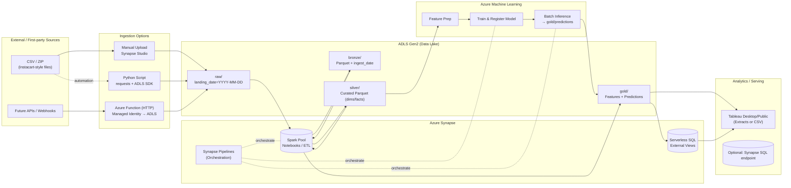
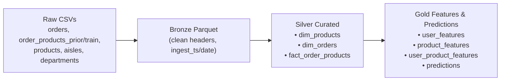
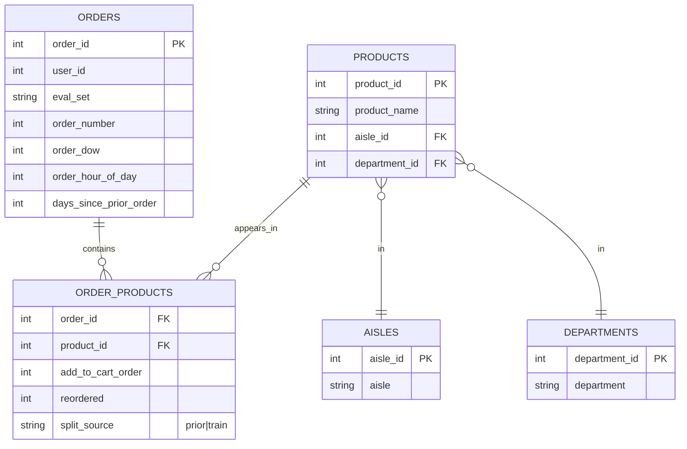

# Customer-Order-Prediction-Analysis
An end-to-end data engineering + machine learning project built on Azure Synapse, ADLS Gen2, Azure ML, and Tableau using the Instacart Online Grocery dataset.

1. **Ingest**
   - Upload CSVs (orders, order_products_prior/train, products, aisles, departments) to `ADLS Gen2` at `data/raw/online_retail_ii/landing_date=YYYY-MM-DD/`.
   - Optionally automate with a Python script or Azure Function.

2. **Bronze (Synapse Spark)**
   - Read all raw CSVs with headers + schema inference.
   - Standardize column names, add `ingest_ts`, `ingest_date`.
   - Write **Parquet** to `data/bronze/online_retail_ii/`.

3. **Silver (Synapse Spark)**
   - Create curated tables:
     - `silver.dim_products` (join products ↔ aisles ↔ departments)
     - `silver.dim_orders` (typed, validated)
     - `silver.fact_order_products` (union prior + train with `split_source`)
   - Partition by appropriate keys (often not necessary here; Parquet is enough).

4. **Gold (Synapse Spark + Azure ML)**
   - Compute features: user, product, user×product.
   - Train a classifier (reorder prediction) in Azure ML; write batch inferences to `gold/predictions/`.
   - Optionally compute top‑K product recommendations per user.

5. **Serve**
   - Create Synapse **Serverless SQL views** over `silver/` and `gold/`.
   - Connect Tableau Desktop (trial) to Synapse, or export CSV extracts for Tableau Public.

 ### Architecture Overview
 

### Medallion Architecture

**Raw**: direct landing zone for CSV/ZIP as-is.

**Bronze**: standardize column names, add ingest metadata, store as Parquet.

**Silver**: dimensional model (orders, products, order_products, aisles, departments).

**Gold**: aggregated features + ML predictions.

### Machine Learning
Features prepared in Synapse Spark → saved to gold/features/.

Model training in Azure ML (e.g., XGBoost, Logistic Regression).

Batch inference → results stored in gold/predictions/.

### Data Model (ERD)

